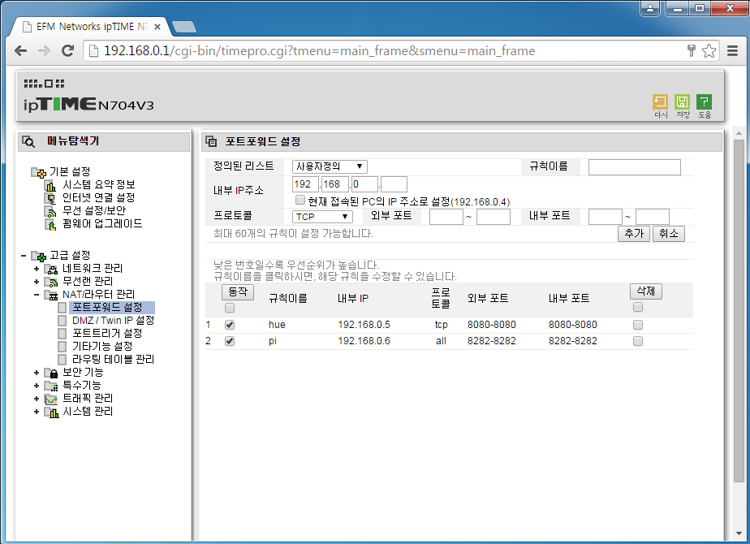
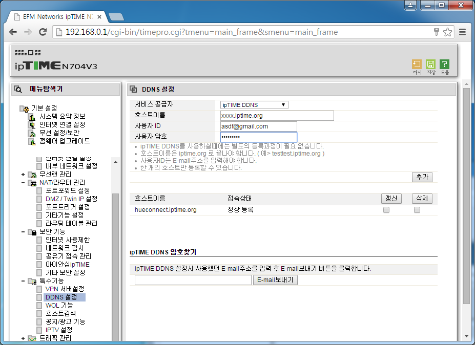
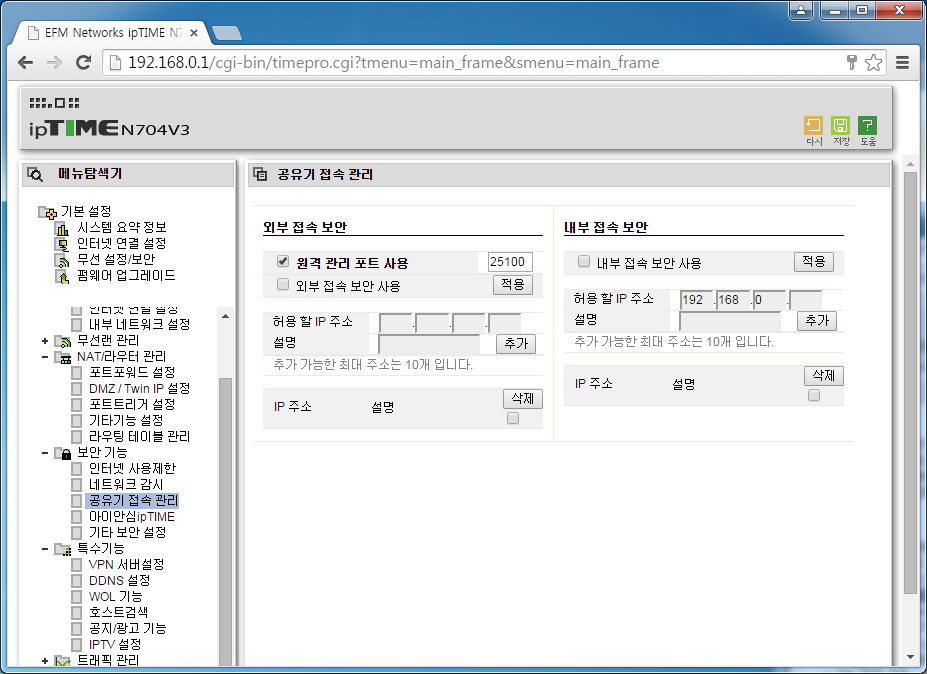

#포트포워딩 설정

인터넷 주소창 192.168.0.1을 눌러 iptime에 접속한다.  
  
고급설정->내부 네트워크 정보에서 포트포워드 할 장비의 ip주소를 기억한다.
  
고급설정->NAT/라우터관리->포트포워드 설정  

  
  
해당 장비의  ip주소를 입력하고 프로토콜은 TCP/UDP로 한다.  
포트번호를 정해주고 저장한다.  
  
#DDNS 설정
  
고급설정->특수기능->DDNS설정  
  
  
  
호스트이름은 xxxx.iptime.org 형식으로 해준다. id는 이메일을 적고 비밀번호를 설정한다.  
만약 정상등록이 뜨지않는다면 펌웨어 업그레이드를 해주어야한다.  
  
 ※ 펌웨어 업그레이드 방법  
 기본설정->펌웨어 업그레이드에서 업그레이드 해주면된다.  
   
외부에서 iptime에 접속하고 싶을때  
고급설정->보안기능->공유기 접속 관리에서 원격포트사용을 체크하고 포트번호를 입력후 적용을 누르면 된다.  
  
  

접속방법은 xxxx.iptime.org:(port number)
  
